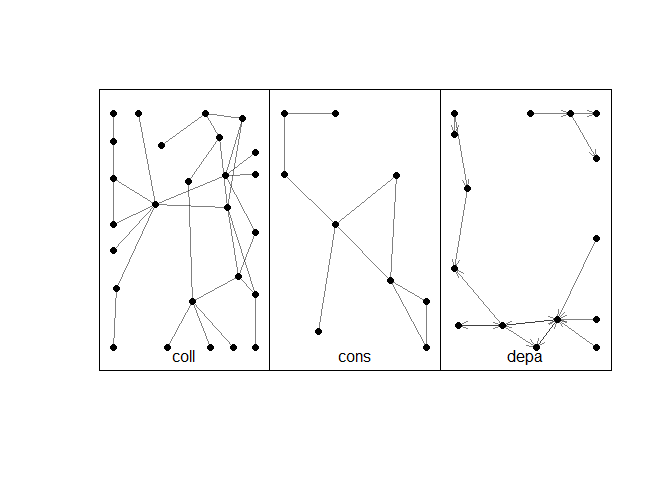
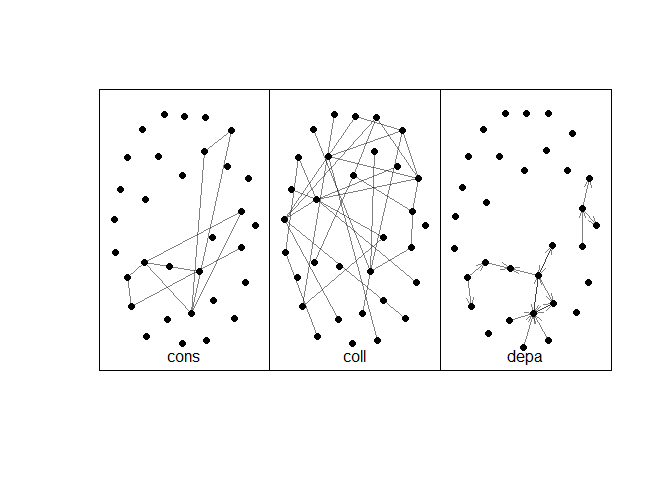
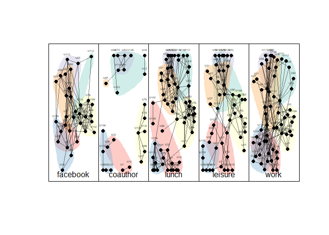
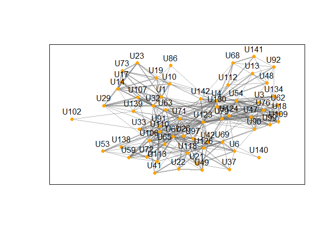

Analyse de réseaux multiplexes avec R - le package multinet
================

- <a href="#importer-et-créer-lobjet" id="toc-importer-et-créer-lobjet">1.
  Importer et créer l’objet</a>
  - <a href="#importer-un-objet-multigraphe"
    id="toc-importer-un-objet-multigraphe">1.1. Importer un objet
    multigraphe</a>
  - <a href="#importer-des-données-au-format-csv-et-igraph"
    id="toc-importer-des-données-au-format-csv-et-igraph">1.2. Importer des
    données au format csv et igraph</a>
  - <a href="#appréhender-les-objets-créés"
    id="toc-appréhender-les-objets-créés">1.3. Appréhender les objets
    créés</a>
  - <a
    href="#aligner-le-multigraphe-tous-les-sommets-dans-toutes-les-couches"
    id="toc-aligner-le-multigraphe-tous-les-sommets-dans-toutes-les-couches">1.4.
    “Aligner” le multigraphe (tous les sommets dans toutes les couches)</a>
- <a href="#quelques-mesures-et-analyses"
  id="toc-quelques-mesures-et-analyses">2. Quelques mesures et
  analyses</a>
  - <a href="#créer-et-étudier-les-couches-individuellemment"
    id="toc-créer-et-étudier-les-couches-individuellemment">2.1. Créer et
    étudier les couches individuellemment</a>
  - <a href="#centralités-voisinage-distances"
    id="toc-centralités-voisinage-distances">2.2. Centralités, voisinage,
    distances</a>
  - <a href="#comparaison-des-couches" id="toc-comparaison-des-couches">2.3.
    Comparaison des couches</a>
  - <a href="#détection-de-communautés"
    id="toc-détection-de-communautés">2.4. Détection de communautés</a>
- <a href="#visualisation" id="toc-visualisation">3. Visualisation</a>
- <a href="#références" id="toc-références">4. Références</a>

*Paul Gourdon et Laurent Beauguitte (UMR Géographie-cités)*

Un réseau multiplexe est un réseau composé d’un ensemble de couches,
chacune d’entre elles représentant un type de relation. Autrement dit,
chaque couche est composée d’un ensemble de sommets et d’un ensemble de
liens entre ces sommets. Tous les sommets - et tous les liens - ne sont
pas nécessairement présents dans toutes les couches.

L’analyse des réseaux multiplexes est un domaine de recherche dynamique
et il n’existe pas à notre connaissance de méthode standardisée faisant
consensus. Le nombre de packages R permettant ce type d’analyse est
réduit : `Muxviz` semble être à l’arrêt, `mully` permet uniquement la
création et la visualisation de réseaux et les packages
`multiplex`-`multigraph` (tous deux développés par la même personne)
sont fondés sur une approche très spécifique qui fera peut-être l’objet
d’un tutoriel ultérieur. Le package présenté ici, `multinet`, propose
plusieurs méthodes d’analyse et de visualisation et il est partiellement
compatible avec `igraph`.

Deux jeux de données sont utilisés dans ce tutoriel :

- le jeu de données *AUCS* incorporé au package et qui décrit 5 types de
  relations entre 64 personnes d’un centre universitaire (Dickison *et
  al.*, 2016) ;

- le jeu de données *cluster* qui décrit trois types de relations entre
  32 établissements du secteur des biotechnologies (Vallier, 2018).

Le présent tutoriel s’inspire largement de l’article du *JSS* paru en
2021 (Magnani *et al.*) et de la documentation du *package* (Magnani *et
al.*, 2022). Les versions utilisées sont 4.1 pour `multinet` et 1.3.5
pour `igraph`.

## 1. Importer et créer l’objet

Le *package* `multinet` crée et manipule des objets intitulés
`Rcpp_RMLNetwork`. Ces objets contiennent une liste de couches (une
couche = un type de relation), une liste d’acteurs (ensemble des sommets
présents, toutes couches confondues), une liste de sommets et une liste
de liens, ces deux dernières listes ayant pour attribut la couche à
laquelle elles appartiennent. Il est possible d’ajouter d’autres
attributs pour les sommets comme pour les liens et ces attributs peuvent
différer d’une couche à l’autre (voir exemple ci-dessous). Les liens
peuvent être de types différents selon les couches considérées :
orientés ou non, valués ou binaires.

Exemple : dans le jeu de données *AUCS*, il existe une couche de
relations Facebook (un lien existe entre deux personnes si elles sont
amies sur ce réseau) et une couche de relations *coauthor* (un lien
existe entre deux personnes si elles ont signé ensemble un article). Les
deux types de relations sont non orientés ; le nombre de sommets diffère
dans les deux couches. On pourrait avoir des attributs différents, tant
pour les liens que pour les sommets dans l’une et l’autre (date
d’inscription sur Facebook, ancienneté du lien, date de la
copublication, etc.).

### 1.1. Importer un objet multigraphe

Le mini-script ci-dessous permet d’étudier le jeu *AUCS* et donne les
noms des différentes couches.

``` r

library(multinet)

net <- ml_aucs()
layers_ml(net)
#> [1] "facebook" "work"     "lunch"    "coauthor" "leisure"
net
#> ml-net[61, 5, 224, 620 (620,0)]
```

La fonction `layers_ml()` donne les identifiants des couches. Taper le
nom de l’objet permet d’obtenir un premier résumé avec, dans l’ordre :
le nombre d’acteurs total, le nombre de couches, le nombre de sommets
(somme des sommets présents dans les différentes couches. 224 étant
inférieur à 5\*61, on en déduit que tous les sommets ne sont pas
présents partout) et le nombre total de liens (620).

### 1.2. Importer des données au format csv et igraph

Pour importer ses propres données, si elles sont au format GraphML (de
type XML), `multinet` sait les lire directement. Sinon, le plus simple
est de créer un objet `igraph` pour chaque couche, un objet `multinet`
vide puis d’y ajouter les couches une à une.

``` r

library(igraph)

# import des données (table des liens)
link <- read.csv("data/2018_vallier_data_edgelist.csv", 
                  encoding = "UTF-8")

# suppression des colonnes inutiles
link <- link[,1:3]

#création des 3 objets igraph correspondant à 3 types de liens
coll <- graph_from_data_frame(link[link$Type_fr == "Collaboration",], 
                              directed=FALSE)

## supprimer les liens multiples : de 62 à 31 liens
coll <- simplify(coll, remove.multiple = TRUE) 

cons <- graph_from_data_frame(link[link$Type_fr == "Consortium",], 
                              directed = FALSE) 

# de 20 à 10 liens
cons <- simplify(cons, remove.multiple = TRUE) 

# 17 liens de type orienté
depa <- graph_from_data_frame(link[link$Type_fr == "Dépannage",1:2], 
                              directed = TRUE) 

# création d'un objet multinet vide
clus <- ml_empty()

#ajout des couches igraph
add_igraph_layer_ml(clus, coll, "coll") 
add_igraph_layer_ml(clus, cons, "cons")
add_igraph_layer_ml(clus, depa, "depa")

#propriétés de l'objet créé
clus
#> ml-net[32, 3, 51, 58 (58,0)]
layers_ml(clus)
#> [1] "coll" "cons" "depa"
```

### 1.3. Appréhender les objets créés

Un moyen de vérifier que l’importation s’est bien passée est de
visualiser les différents types de relations - les options de
visualisation sont évoquées à la fin de ce tutoriel.

``` r
# données AUCS
plot(net, vertex.labels = NA)
```


``` r

# données cluster
plot(clus, vertex.labels = NA) 
```



Un moyen sans doute plus sûr est d’utiliser la fonction `summary().`

``` r
summary(net)
#>           n   m dir nc slc       dens        cc      apl dia
#> _flat_   61 620   0  1  61 0.33879781 0.4761508 2.062842   4
#> coauthor 25  21   0  8   6 0.07000000 0.4285714 1.500000   3
#> facebook 32 124   0  1  32 0.25000000 0.4805687 1.955645   4
#> leisure  47  88   0  2  44 0.08140611 0.3430657 3.115911   8
#> lunch    60 193   0  1  60 0.10903955 0.5689261 3.188701   7
#> work     60 194   0  1  60 0.10960452 0.3387863 2.390395   4
summary(clus)
#>         n  m dir nc slc       dens        cc      apl dia
#> _flat_ 32 99   1  1  32 0.09979839 0.1578947 3.015538   7
#> coll   27 62   1  1  27 0.08831909 0.0400000 3.421652   7
#> cons    9 20   1  1   9 0.27777778 0.3529412 2.388889   5
#> depa   15 17   1  2  11 0.08095238 0.1304348 1.775000   3
```

Les lignes concernent la couche dite `_flat_` (somme des différentes
matrices d’adjacence) et les couches propres à chaque type de relation.
Les colonnes indiquent :

- le nombre de sommets non isolés (`n`)

- le nombre de liens (`m`) ;

- leur caractère orienté (`dir`) (1 = oui, 0 = non) ;

- le nombre de composantes (sommets isolés non inclus) - en cas de
  couche avec liens orientés, l’orientation est prise en compte et le
  nombre donné correspond aux composantes fortement connexes (`nc`) ;

- la densité (`dens`) ;

- la transitivité globale (orientation éventuelle des liens non prise en
  compte) (`cc`) ;

- la longueur moyenne des plus courts chemins (`apl` pour *average path
  length*) ;

- le diamètre de la plus grande composante connexe (`dia`).

### 1.4. “Aligner” le multigraphe (tous les sommets dans toutes les couches)

Comme le montrent les tableaux précédents, tous les acteurs ne sont pas
présents dans chaque couche.

Pour certaines analyses ou visualisations, il peut être utile de prendre
en compte les acteurs qui n’ont aucun lien dans une couche donnée,
représentés par des sommets isolés. Le *package* `multinet` permet
d’ajouter tous les acteurs à toutes les couches d’un graphe multiplexe.
Pour ce faire, il est nécessaire d’enregistrer le multigraphe au format
`multilayer` puis de spécifier le paramètre `aligned = TRUE` lors du
nouvel import.

``` r

# pour les données AUCS  : option à l'import

net_aligned <- read_ml(system.file("extdata", "aucs.mpx", package = "multinet"), 
                       "AUCS", aligned = TRUE)
net_aligned # on retrouve bien 61 acteurs * 5 couches = 305 sommets en tout
#> ml-net[61, 5, 305, 620 (620,0)]

# pour les données cluster : enregistrement puis import

write_ml(clus, "data/clusAlign", format = "multilayer", 
         sep = ',')


clus_aligned <- read_ml("data/clusAlign", aligned = TRUE)

clus_aligned # 32 acteurs * 3 couches = 96 sommets
#> ml-net[32, 3, 96, 58 (58,0)]

# test : différence entre les deux résumés clus et clus_aligned ?

identical(summary(clus), summary(clus_aligned)) 
#> [1] TRUE
```

Les résumés des deux graphes multiplexes sont strictement identiques car
la variable `n` correspond au nombre de sommets **connectés** dans
chaque couche et tous les calculs de la fonction `summary()` sont
effectués sur cet ensemble de sommets connectés.

La visualisation permet en revanche de faire figurer l’ensemble des
sommets dans chaque couche.

``` r

# spatialiser les sommets dans la même position que pour la 3ème couche
l3 <- layout_multiforce_ml(clus_aligned, w_inter = 1, 
                            w_in = c(0, 0, 1), 
                            gravity = c(0, 0, 1))

# visualisation des trois couches

plot(clus_aligned, layout = l3, grid = c(1, 3), vertex.labels = "")
```



Si la fonction `summary` renvoie les mêmes résultats que le paramètre
`aligned` soit `TRUE` ou `FALSE`, les fonctions de comparaison entre les
différentes couches prennent bien en compte la présence ou l’absence des
sommets isolés. Travailler sur une version alignée ou non alignée du
graphe multiplexe aura donc un grand impact.

## 2. Quelques mesures et analyses

### 2.1. Créer et étudier les couches individuellemment

Pour étudier les couches de relations de façon individuelle, inutile
d’utiliser `multinet`, `igraph` ou `sna` suffisent largement. La seule
couche inédite, produite par le *package*, est la couche `_flat_` : elle
peut être exportée vers `igraph` avec le mini-script suivant:

``` r
clus_i <- as.list(clus)
flat <- clus_i$"_flat_"
```

Les autres couches peuvent être récupérées comme suit :

``` r
# créer un object igraph à partir d'une couche

# acteurs disposant d'un compte facebook : n = 32
(fb <- as.igraph(net, "facebook")) 

# version alignée : ensemble des acteurs présents dans le flat
# n = 61 (avec sommets isolés)
fb <- as.igraph(net_aligned, "facebook") 

# même opération mais à partir de la version non-alignée du graphe
fb <- as.igraph(net, "facebook", all.actors = TRUE) 

# retirer deux couches en même temps

f_l_net <- as.igraph(net, 
                     c("facebook","lunch"), # choix des couches
                     merge.actors=TRUE)     # ne conserver qu'un seul sommet par                                             acteur (toutes couches confondues) n = 60
```

Il est possible de créer d’autres couches à l’aide des fonctions
`flatten_ml` et `project_lm` :

- `flatten_ml` fusionne deux couches ou plus et crée un lien entre deux
  sommets si un lien est présent dans au moins une des couches.
  L’utilisation de l’argument `method = "weighted"` permet de créer un
  lien valué si on le souhaite (somme des liens entre les acteurs selon
  les couches considérées) ;

- `project_ml` fusionne deux couches ou plus et crée un lien entre deux
  sommets si le lien est présent dans chacune des couches fusionnées.

### 2.2. Centralités, voisinage, distances

Un certain nombre de fonctions permettent d’étudier le degré d’un sommet
de manière à prendre en compte la multiplexité des relations. La
fonction `degree_ml` permet d’obtenir les degrés d’une couche donnée ;
`neighborhood_ml` permet de connaître le degré d’un sommet précis dans
une couche donnée. `xneighborhood_ml` renvoie le nombre de voisins d’un
sommet donné présents dans la seule couche étudiée. `relevance_ml` donne
le pourcentage de voisins présents dans une couche donnée,
`xrelevance_ml` le pourcentage de voisins présents dans cette seule
couche.

``` r
neighborhood_ml(net,"U54","work")
#> [1] 8
xneighborhood_ml(net,"U54","work")
#> [1] 4
relevance_ml(net,"U54","work")
#> [1] 0.4210526
xrelevance_ml(net,"U54","work")
#> [1] 0.2105263
```

Le sommet `U54` a 8 voisins dans la couche `work`, 4 sont voisins dans
cette seule couche, cette dernière concentre 42% des voisins de `U54`
(toutes couches confondues), enfin 21% des liens de `U54` dans `work`
sont spécifiques à cette couche.

Il est également possible de calculer la centralité de degré de manière
plus systématique.

``` r
# degrés sur le réseau net

## si la couche n'est pas précisée, le calcul s'effectue sur flat
deg <- degree_ml(net) 
## actors_ml renvoie les noms sous forme de liste :
names(deg) <- unlist(actors_ml(net)) 
## ordonner le vecteur de manière décroissante
top_degrees <- head(deg[order(-deg)])

# degrés sur le réseau clus

degc <- degree_ml(clus_aligned)
names(degc) <- unlist(actors_ml(clus_aligned))
top_degc <- head(degc[order(-degc)])

# tableau des degrés selon les couches

## réseau net

(topdeg <- 
data.frame(actor = names(top_degrees),
          facebook = degree_ml(net, actors = names(top_degrees), layers = "facebook"),
          leisure = degree_ml(net, actors = names(top_degrees), layers = "leisure"),
          lunch = degree_ml(net, actors = names(top_degrees), layers = "lunch"),
          coauthor = degree_ml(net, actors = names(top_degrees), layers = "coauthor"),
          work = degree_ml(net, actors = names(top_degrees), layers = "work"),
          flat = top_degrees)) 
#>      actor facebook leisure lunch coauthor work flat
#> U4      U4       12       1    15       NA   21   49
#> U67    U67       13       2    12       NA   20   47
#> U91    U91       14      14     7        3    8   46
#> U123  U123       11      NA     6       NA   27   44
#> U79    U79       15       7    13       NA    9   44
#> U110  U110        9       7     7        4   14   41
```

NOTE : NA indique que le sommet en question n’a pas de voisin dans la
couche considérée (ex. U4 dans la couche co-auteur).

Si dans une couche les liens sont orientés, il est possible de préciser
le mode voulu : `"in"` (degré entrant), `"out"` (sortant) ou `"all"`
(total). Lorsque le graphe multiplexe est “aligné”, l’absence de lien
produit non pas un `NA` mais bien un `0` car le sommet isolé est présent
dans la couche.

``` r
# réseau clus (avec une couche orientée)

(topdegc <- 
data.frame(actor = as.character(names(top_degc)),
          coll = degree_ml(clus_aligned, actors = names(top_degc), layers = "coll"),
          cons = degree_ml(clus_aligned, actors = names(top_degc), layers = "cons"),
          depa_in = degree_ml(clus_aligned, actors = names(top_degc), layers = "depa", mode = "in"), #degré entrant
          depa_out = degree_ml(clus_aligned, actors = names(top_degc), layers = "depa", mode = "out"), #degré sortant
          flat = top_degc)) 
#>    actor coll cons depa_in depa_out flat
#> 6      6    5    1       2        4   12
#> 28    28    1    4       5        2   12
#> 4      4    3    2       1        2    8
#> 5      5    1    4       1        1    7
#> 41    41    7    0       0        0    7
#> 7      7    4    2       0        0    6
```

Il est possible de calculer des distances en prenant en compte la
multiplexité des relations à l’aide de la fonction `distance_ml`. Les
chemins ne sont plus calculés couche par couche mais prennent en compte
les passages d’une couche à une autre. Autrement dit, deux acteurs A et
D (notés A / A’ et D / D’ selon la couche considérée) peuvent être non
connectés dans les deux couches : aucun chemin possible entre A et D sur
la couche N (*e.g.* relations Twitter) ; aucun chemin possible entre A’
et D’ sur la couche N’ (*e.g.* relations Facebook). Pourtant un chemin
est possible si l’on considère conjointement les relations des deux
couches (Twitter et Facebook) : A → A’ → B’ → B → C → C’ → D’ → D.

<figure>

<figcaption aria-hidden="true">Source : Magnani &amp; Rossi,
2013</figcaption>
</figure>

Le chemin total correspond ici à une distance de 2 sur la couche N’
(Facebook) et à une distance de 1 sur la couche N (Twitter) soit un
chemin de longueur 3 au total.

Il s’agit alors d’une mesure de distance de Pareto qui prend en compte
la longueur de chemins non-dominés (*non-dominated path lengths*). Un
chemin est considéré dominant par rapport à un autre 1. s’il est plus
court, toutes couches confondues (longueur totale), et ce quelle que
soit la pondération affectée aux liens des différentes couches, et 2.
s’il contient au moins un plus court chemin sur une couche donnée. Le
détail de ces mesures figure dans Magnani & Rossi (2013).

La fonction `distance_ml` renvoie donc l’ensemble des chemins dominants
mais qui, sans information complémentaire sur l’efficacité (*i.e* le
poids) des liens dans chaque couche, sont incomparables entre eux,
c’est-à-dire non-dominés.

``` r
# calcul des non-dominated path lengths entre deux sommets 
subset(distance_ml(net,from = "U54",to = "U41", method="multiplex"), 
       lunch == 1 & facebook == 2 | work == 3)
#>    from  to facebook work lunch coauthor leisure
#> 3   U54 U41        2    0     1        0       0
#> 10  U54 U41        0    3     0        0       0
```

L’exemple ci-dessus montre 2 chemins non-dominés entre `U54` et `U41` de
longueur 3[^1].

- un chemin comprend une distance de 1 dans la couche `lunch` et une
  distance de 2 dans la couche `facebook` : `U54` a déjeuné avec *i* qui
  a déjeuné avec `U41`; U54 travaille avec *j* qui travaille avec *k*
  qui travaille avec `U41`. Cette information signifie qu’il n’y a pas
  de chemin de longueur 2 avec 2 liens dans la couche `facebook` et 0
  dans toutes les autres couches : ce chemin, s’il existait, serait
  nécessairement plus court que `2 facebook + 1 lunch`, et ce, quel que
  soit le poids attribué aux liens dans la couche `facebook` et `lunch`.

- l’autre chemin affiche une longueur 3 à l’intérieur de la seule couche
  `work`.

Sans information supplémentaire, aucun de ces chemins ne domine l’autre
: la longueur totale est la même pour ces 2 chemins et ils intègrent
potentiellement un plus court chemin dans une des couches du réseau
multiplexe (selon la pondération affectée aux liens dans les couches).

``` r
# vérification du fait qu'il n'existe pas de chemin entre U54 et U41 
# comprenant uniquement 2 liens dans la couche facebook
subset(distance_ml(net,from = "U54",to = "U41", method="multiplex"),
       facebook == 2 )
#>    from  to facebook work lunch coauthor leisure
#> 3   U54 U41        2    0     1        0       0
#> 5   U54 U41        2    1     0        1       0
#> 20  U54 U41        2    0     0        3       0
#> 24  U54 U41        2    0     0        1       1
#> 25  U54 U41        2    0     0        0       2
```

### 2.3. Comparaison des couches

`multinet` permet également de comparer les couches entre elles.
Plusieurs méthodes sont proposées et seule une poignée est détaillée
ici. On peut distinguer les comparaisons liées à la la distribution des
degrés, celles portant sur la présence des mêmes sommets et enfin les
corrélations entre matrices (liens, triangles, etc.). Les méthodes
proposées sont issues de l’article de Brodka *et al.* (2018).

Exemple : fonction de dissimilarité de Jeffrey concernant la
distribution des degrés (plus le résultat est élevé, plus les deux
couches sont dissemblables).

``` r
#comparaison distribution degré
layer_comparison_ml(net, method = "jeffrey.degree")
#>           facebook      work     lunch  coauthor   leisure
#> facebook 0.0000000 0.7106788 0.4207678 2.0214010 1.0177980
#> work     0.7106788 0.0000000 0.8372414 0.5917494 0.2118452
#> lunch    0.4207678 0.8372414 0.0000000 2.8966530 1.3288250
#> coauthor 2.0214010 0.5917494 2.8966530 0.0000000 0.4521076
#> leisure  1.0177980 0.2118452 1.3288250 0.4521076 0.0000000
```

Ainsi, dans cet exemple la distribution des degrés dans la couche `work`
ressemble le plus à celle de la couche `leisure`.

NOTE : toutes les mesures de comparaisons sur les degrées et les acteurs
sont sensibles au fait d’inclure ou non l’ensemble des acteurs dans
chaque couche. Cela est parfaitement logique, car dans une version
alignée du réseau multiplexe, on ajoute des sommets isolés de degré 0.

``` r
#comparaison distribution degré sur la version alignée du réseau net
layer_comparison_ml(net_aligned, method = "jeffrey.degree")
#>           facebook     lunch  coauthor   leisure      work
#> facebook 0.0000000 1.4143833 0.4799452 0.2754121 0.1817213
#> lunch    1.4143833 0.0000000 3.4654016 1.6748765 0.3830254
#> coauthor 0.4799452 3.4654016 0.0000000 0.7262190 1.3307614
#> leisure  0.2754121 1.6748765 0.7262190 0.0000000 0.2961610
#> work     0.1817213 0.3830254 1.3307614 0.2961610 0.0000000
```

- Corrélation entre les degrés :
  `layer_comparison_ml(net, method = "pearson.degree")`. Le résultat
  varie entre -1 (un sommet avec un degré élevé dans une couche a un
  degré faible dans l’autre) et 1 (degré élevé dans les deux couches).

``` r
#même degré dans différentes couches - qq soit les voisins
layer_comparison_ml(clus, method="pearson.degree")
#>            coll       cons      depa
#> coll  1.0000000 -0.6310780 0.1426954
#> cons -0.6310780  1.0000000 0.3392003
#> depa  0.1426954  0.3392003 1.0000000
```

Dans le réseau `clus`, les degrés de la couche `cons` sont faiblement,
mais positivement, corrélés avec les degrés de la couche `depa`. Les
degrés de la couche `coll` (collaboration) sont assez fortement corrélés
négativement avec ceux de la couche `cons` : autrement dit une forte
centralité de degré dans la couche des collaborations renvoie plutôt à
une faible centralité dans la couche des participations à des
consortiums. Ce résultat confirme ce que l’on pouvait soupçonner en
regardant le tableau des plus hautes centralités de degré selon les
couches.

- Comparer la présence des acteurs dans toutes les couches:
  `layer_comparison_ml(net, method = "jaccard.actors")` : le résultat
  varie entre 0 (aucun acteur commun) et 1 (les mêmes acteurs sont
  présents dans les deux couches comparées).

``` r
#mêmes sommets dans les différentes couches (0 à 1)
layer_comparison_ml(clus, method="jaccard.actors")
#>           coll      cons      depa
#> coll 1.0000000 0.2857143 0.3125000
#> cons 0.2857143 1.0000000 0.4117647
#> depa 0.3125000 0.4117647 1.0000000
```

Les acteurs présents dans la couche `cons` sont similaires à 41% à ceux
de la couche `depa` .

*NOTE : ce type de calcul n’a aucun intérêt sur la version alignée du
réseau, la totalité des acteurs étant présents dans chaque couche, la
matrice est remplie de 1.*

- Similarité des liens :
  `layer_comparison_ml(net, method = "jaccard.edges")`. Le résultat
  varie entre 1 (l’ensemble des liens sont identiques entre les deux
  couches) et 0 (aucun lien en commun) ; 0.5 indique qu’il y a 50% des
  liens en commun, c’est-à-dire entre les mêmes paires de sommets.

``` r
#mêmes liens entre mêmes paires de sommets
layer_comparison_ml(net, method="jaccard.edges")
#>            facebook       work      lunch   coauthor   leisure
#> facebook 1.00000000 0.18656716 0.17843866 0.05839416 0.1584699
#> work     0.18656716 1.00000000 0.33910035 0.09137056 0.2051282
#> lunch    0.17843866 0.33910035 1.00000000 0.06467662 0.2772727
#> coauthor 0.05839416 0.09137056 0.06467662 1.00000000 0.1010101
#> leisure  0.15846995 0.20512821 0.27727273 0.10101010 1.0000000
```

Ici les deux couches possédant le plus de liens en commun sont les
couches `work` et `lunch` : elles partagent 33% de liens en communs.

Il est également possible de sortir des seules comparaisons dyadiques
(relation entre des paires de sommets ) en appliquant la même méthode
mais sur les triangles (triades).

``` r
#mêmes triangles entre mêmes ensemble de 3 sommets
layer_comparison_ml(net, method="jaccard.triangles")
#>             facebook        work       lunch    coauthor    leisure
#> facebook 1.000000000 0.046448087 0.069053708 0.005813953 0.02369668
#> work     0.046448087 1.000000000 0.151741294 0.009259259 0.07407407
#> lunch    0.069053708 0.151741294 1.000000000 0.007968127 0.10861423
#> coauthor 0.005813953 0.009259259 0.007968127 1.000000000 0.00000000
#> leisure  0.023696682 0.074074074 0.108614232 0.000000000 1.00000000
```

### 2.4. Détection de communautés

Quatre algorithmes de détection de communautés sont implémentés dans le
package `multinet` : `clique percolation` (méthode basée sur la
recherche de cliques adjacentes), `abacus` (méthode basée sur la
détection de motifs), `Infomap` (utlisation de marches aléatoires) et
`Louvain` (optimisation de la modularité). Tous ces algorithmes ont été
conçus pour des réseaux multiplexes (*cf.* les références fournies dans
la documentation du package pour la fonction `multinet.communities`).

La fonction de détection de communautés crée un `data.frame` listant sur
trois colonnes les sommets, les couches et un identifiant correspondant
à la communauté d’apartenance (`cid`). Appliquer la fonction `table` sur
cet identifiant permet de connaître le nombre et la taille des
communautés détectées.

``` r
#tester les 4 algorithmes
com1 <- glouvain_ml(net)
com2 <- clique_percolation_ml(net)
com3 <- abacus_ml(net, min.actors = 3, min.layers = 3) 
com4 <- infomap_ml(net)

#crée dataframe : sommet, couche, communauté
head(com2, 6) 
#>   actor    layer cid
#> 1    U4 facebook   0
#> 2    U4     work   0
#> 3    U4    lunch   0
#> 4   U71 facebook   0
#> 5   U71     work   0
#> 6   U71    lunch   0

#nb communautés et taille selon l'algo choisi
table(com1$cid)
#> 
#>  0  1  2  3  4 
#> 44 37 60 53 30
#table(com2$cid)
#table(com3$cid)
table(com4$cid)
#> 
#>  0  1  2  3  4  5 
#> 44 28 34 53 30 35

#indicateurs
modularity_ml(net, com1, gamma = 1, omega = 1)
#> [1] 0.5132803
#

#comparaison entre deux partitions 1 - 4
nmi_ml(net, com1, com4)
#> [1] 0.9171475
omega_index_ml(net, com1, com4)
#> [1] 0.8579611
```

Trois indicateurs peuvent être calculés pour évaluer la qualité des
partitions produites : modularité, indice omega et information mutuelle
normalisée (*NMI* en anglais, indice issue de la théorie de
l’information). Il est possible de comparer directement deux partitions
pour ces trois indicateurs. Le script ci-dessus montre que Louvain et
Infomap donnent des partitions obtenant des scores quasi similaires.

Il est possible de visualiser les communautés obtenues.

``` r
#visualisation
plot(net, vertex.labels.cex=.3, com=com4)
```



On peut choisir de visualiser le réseau “aligné” afin que les sommets
soient positionnés de la même façon sur toutes les couches. La
comparaison visuelle est plus facile mais les sommets isolés perturbent
la lisibité de la figure obtenue.

``` r
#visualiser le réseau aligné (ici on garde la spatialisation de la première couche)

l4 <- layout_multiforce_ml(net_aligned, w_inter = 1, 
                            w_in = c(1, 0, 0, 0, 0 ), 
                            gravity = c(1, 0, 0, 0, 0 ))


plot(net_aligned, vertex.labels.cex=.3, com=com4, layout = l4)
```


## 3. Visualisation

En ce qui concerne la visualisation, `multinet` permet de contrôler la
forme, la taille et la couleur des sommets, la couleur et l’épaisseur
des liens, la présence et la taille des labels. Seuls deux algorithmes
de positionnement des sommets sont proposés : cercle
(`layout_circular_ml`) et un algorithme *force-based*
(`layout_multiforce_ml`).

Au-delà des paramètres que l’on peut régler par défaut, on trouvera
quelques indications pour utiliser certaines variables attributaires
lors de la visualisation dans la partie 4 de Magnani *et al.* (2021),
notamment pour attribuer des couleurs aux différents sommets en fonction
des couches ou d’une variable `role` pour les acteurs.

Le petit script ci-dessous crée une couche correspondant à la somme des
liens présents dans trois couches `work`, `facebook` et `lunch` du jeu
de données *AUCS*. On représente ensuite le graphe en faisant varier la
taille des liens selon leur poids.

``` r
# créer une couche valuée à partir de work, facebook et lunch
layers_ml(net)
#> [1] "facebook" "work"     "lunch"    "coauthor" "leisure"

flatten_ml(net, new.layer = "wfl", layers = c("work", "facebook", "lunch"),
                   method = "weighted", force.directed = FALSE, all.actors = FALSE)

layers_ml(net)
#> [1] "facebook" "work"     "lunch"    "coauthor" "leisure"  "wfl"

attributes_ml(net, target = "edge")
#>   layer   name   type
#> 1   wfl weight double

# récupérer les poids pour toutes les couches 
# (sinon cela ne fonctionne pas dans car la fonction plot se base sur le graphe multicouche)

attr_values <- get_values_ml(net, "weight", edges = edges_ml(net))

# représenter la couche

l <- layout_multiforce_ml(net, w_inter = 1, 
                            w_in = c(0, 0, 0, 0, 0, 1), 
                            gravity = c(0, 0, 0, 0, 0, 1))

plot(net,                        #objet mulinet
     layers = "wfl",             #choix des couches
     layout = l,                 #algorithme de placement
     vertex.size = 5,            #taille des sommets
     vertex.color = "orange",    #couleur des sommets
     vertex.labels.size = 0.3,   #taille des labels
     edge.width = unlist(attr_values),  #taille des liens
     edge.col = "grey40",        #couleur des liens
     show.layer.names = FALSE)   #afficher le nom de la couche
```



Dès lors que l’on souhaite visualiser des variables attributaires, les
solutions proposées sont selon nous complexes et peu pratiques car il
faut retirer les attributs des acteurs, des sommets ou des liens, et les
convertir dans le format voulu (vecteur numérique ou de couleurs). La
solution la plus simple est sans doute de convertir les couches en
format `igraph` et d’utiliser les fonctions de visualisation inhérentes
à `igraph` ou bien celles de `ggplot2` et `ggraph`.

## 4. Références

Piotr Brodka, Anna Chmiel, Matteo Magnani et Giancarlo Ragozini (2018).
[Quantifying layer similarity in multiplex networks: a systematic
study](https://royalsocietypublishing.org/doi/pdf/10.1098/rsos.171747).
*Royal Society Open Science* 5(8): 171747

Mark E. Dickison, Matteo Magnani et Luca Rossi. *Multilayer social
networks*. Cambridge University Press, 2016.

Mikko Kivelä, Alex Arenas, Marc Barthelemy, James P. Gleeson, Yamir
Moreno et Mason A. Porter (2014). [Multilayer
Networks](https://academic.oup.com/comnet/article/2/3/203/2841130).
*Journal of Complex Networks*, 2(3), 203–271.

Matteo Magnani, Luca Rossi et Davide Vega. [Analysis of Multiplex Social
Networks with R](http://multilayer.it.uu.se/jss.pdf). *Journal of
Statistical Software*, 98(8), 2021.

Matteo Magnani, Luca Rossi (2013). [Pareto Distance for Multi-layer
Network
Analysis](https://link.springer.com/chapter/10.1007/978-3-642-37210-0_27).
*Social Computing, Behavioral-Cultural Modeling and Prediction*, Vol.
7812, pp. 249-256. Springer Berlin Heidelberg.

[Documentation du package
multinet](https://cran.r-project.org/web/packages/multinet/multinet.pdf)
: Matteo Magnani, Luca Rossi, Davide Vega et Obaida Hanteer (2022).
*multinet: Analysis and Mining of Multilayer Social Networks*.

Estelle Vallier. [Voyage en
cluster](https://hal.archives-ouvertes.fr/hal-01743633/document).
*ARCS - Analyse de réseaux pour les sciences sociales*, 2018.

[^1]: On obtient parfois des résultats qui semblent peu compréhensibles
    avec cette fonction : le tableau renvoie des longueurs totales
    (sommes des chemins en ligne) qui sont différentes. Mais si un
    chemin est renvoyé dans le tableau, c’est qu’il est incomparable à
    un autre si l’on a pas davantage d’informations sur le poids des
    liens dans chaque couche (un lien dans une couche peut par exemple
    être 3 fois plus efficace que celui d’une autre couche). Si on fait
    l’hypothèse que tous les liens se valent quelle que soit la couche,
    il suffit alors de produire une somme en ligne et de ne conserver
    que les chemins ayant la longueur totale minimum.
